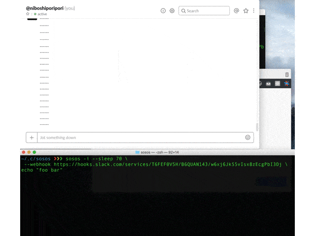
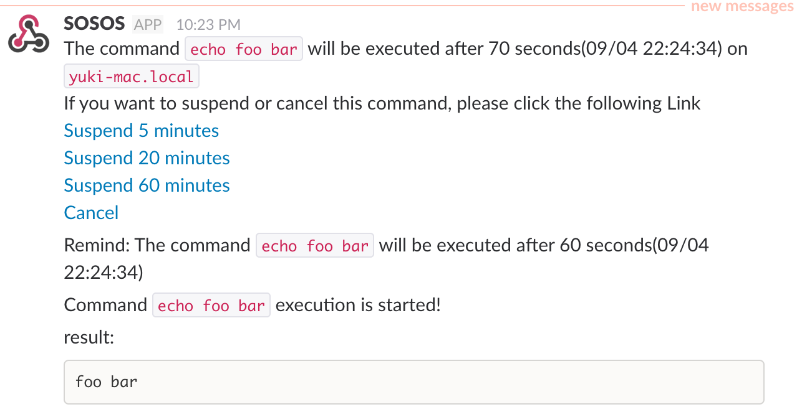
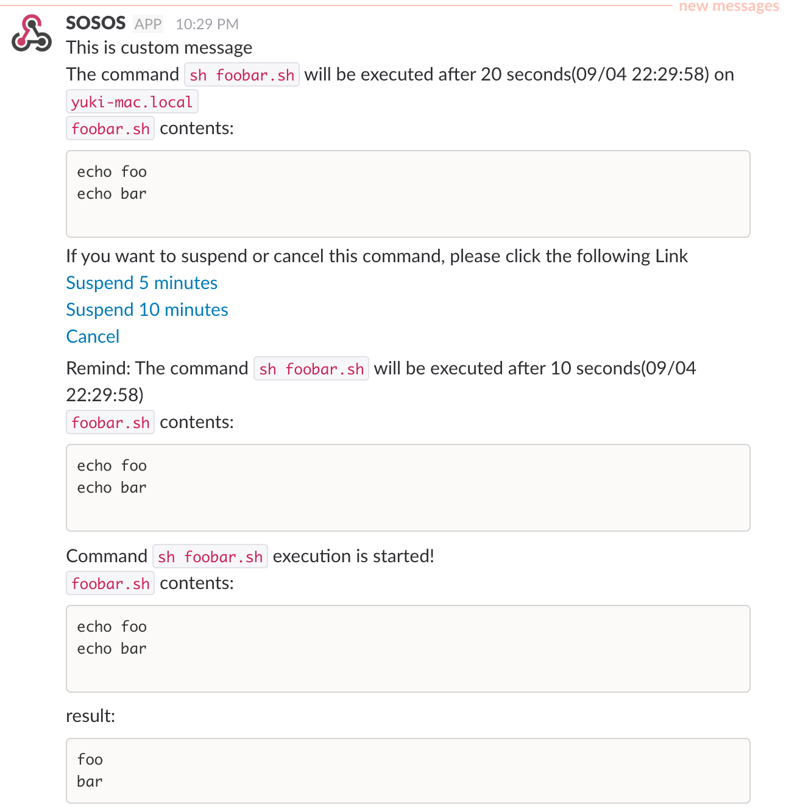

# SOSOS
sosos is the minimal command wrapper for realizing delay, notification, cancellation via chat.



# Usage

## minimal example:

```bash
$ hostname
yuki-mac.local

$ sosos --sleep 70 \
 --webhook https://hooks.slack.com/services/your/incoming/webhook/url \
 echo "foo bar"
```



## advanced example:

```bash
$ cat ~/.config/sosos/.sosos.yaml
webhooks:
- name: default
  url: https://hooks.slack.com/services/your/incoming/webhook/url
```

```bash
$ cat foobar.sh
echo foo
echo bar
```

```bash
$ sosos --sleep 20 \
 --webhook default \
 --message "This is custom message" \
 --suspend-minutes 5,10 \
 --remind-seconds 10 \
 sh foobar.sh
```



# Installation

```bash
$ go get github.com/mpppk/sosos
```

or download binary from [release page](https://github.com/mpppk/sosos/releases)