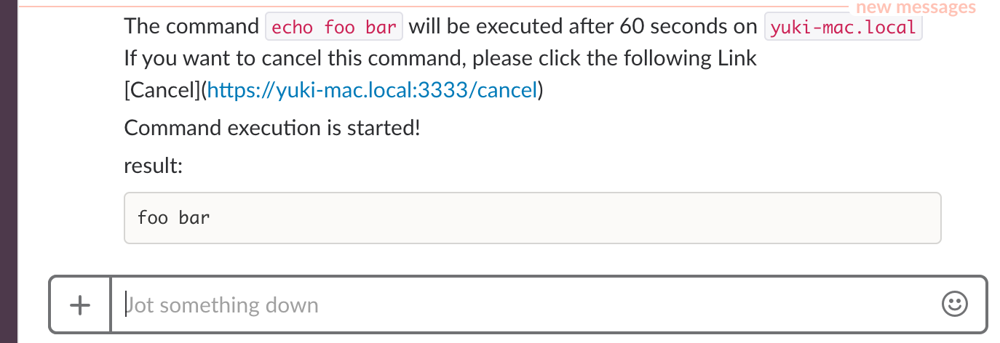

# SOSOS
sosos is a minimal command wrapper for realizing delay, notification, cancellation etc via chat.

# Usage

```bash
sosos --sleep 60 \
 --webhook https://hooks.slack.com/services/your/incoming/webhook/url \
 echo "foo bar"
```



# Installation

```bash
$ go get github.com/mpppk/sosos
```